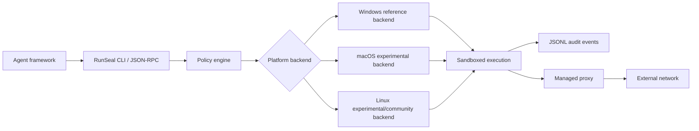

# RunSeal RFCs

English | [简体中文](README.zh-CN.md)

RunSeal is for agent applications that need to run real local tools without giving the agent full control of the endpoint.

Unlike VM or container sandboxes, RunSeal keeps execution close to the host OS so commands can use installed toolchains, workspace files, enterprise endpoint configuration, and local app integrations. Unlike raw shell execution, every command runs through a policy-governed boundary with filesystem restrictions, proxy-only networking, synthetic home/profile roots, cleanup, and structured audit events.

The Windows reference backend is the MVP enterprise baseline.

> **Embeddable local security runtime for endpoint AI agents.**

macOS and Linux remain part of the cross-platform contract, but their backends are contribution tracks that promote individual capabilities experimentally. Current macOS experimental coverage is limited to `read-only` and `workspace-write` with `network.disabled`. Current Linux experimental coverage is limited to `read-only`, `workspace-write`, and `workspace-contained` with `network.disabled`. A backend capability is promoted only when it passes the shared conformance suite and reports unsupported requests fail-closed.

RunSeal does **not** aim to be a VM platform, a Docker Desktop replacement, or a cloud multi-tenant sandbox service. It turns local agent execution into a policy-governed, auditable capability.

## Core idea

AI agents increasingly need to run local commands: package managers, tests, linters, code generators, data-processing scripts, internal API clients, and loose community skills. The useful security boundary is not just “ask the user before every command”. The runtime needs a technical boundary that lets low-risk work continue autonomously while forcing sensitive operations through policy.

RunSeal follows the Codex-style model:

- **Sandbox**: the OS-enforced boundary for filesystem, process, network, and resources.
- **Approval/policy**: the governance layer that decides what can run automatically, what is denied, and what requires escalation.
- **Execution**: a single command or tool run inside a seal.
- **Controlled proxy**: the only network path for enterprise use, able to enforce routes, inject auth, redact data, and audit traffic.
- **Host OS capability preserving**: keeps installed toolchains, workspace files, enterprise configuration, and local app integrations available inside the sandbox.


## Architecture flow



## Initial RFC set

1. [RFC-0001: Codex-style OS-native sandbox abstraction](rfcs/0001-codex-style-os-native-sandbox-abstraction.md)
2. [RFC-0002: Controlled proxy networking](rfcs/0002-controlled-proxy-networking.md)
3. [RFC-0003: RunSeal policy schema](rfcs/0003-runseal-policy-schema.md)
4. [RFC-0004: Audit event model](rfcs/0004-audit-event-model.md)
5. [RFC-0005: Workspace/user simplification model](rfcs/0005-workspace-user-simplification-model.md)
6. [RFC-0006: Stable execution protocol](rfcs/0006-stable-execution-protocol.md)
7. [RFC-0007: Platform backend threat model and capability matrix](rfcs/0007-platform-backend-threat-model.md)
8. [RFC-0008: MVP implementation plan](rfcs/0008-mvp-implementation-plan.md)
9. [RFC-0009: MVP implementation baseline](rfcs/0009-mvp-implementation-baseline.md)
10. [RFC-0010: RFC/implementation boundary and Windows reference extraction](rfcs/0010-rfc-implementation-boundary-and-windows-reference-extraction.md)
11. [RFC-0011: stdin bytes and file input](rfcs/0011-stdin-bytes-encoding.md)
12. [RFC-0012: Windows single identity and global policy epoch model](rfcs/0012-windows-single-identity-and-global-policy-epoch.md)
13. [RFC-0013: RunSeal service mode](rfcs/0013-service-mode.md)
14. [RFC-0014: Portable backend onboarding for macOS and Linux](rfcs/0014-portable-backend-onboarding.md)
15. [RFC-0015: Escape definition and adversarial conformance model](rfcs/0015-escape-definition-and-adversarial-conformance.md)
16. [RFC-0016: Adversarial conformance harness and case format](rfcs/0016-adversarial-conformance-harness-and-case-format.md)

## CLI vocabulary

The primary CLI verb is `exec`:

```bash
runseal exec --policy workspace-write --network proxy -- pnpm test
runseal exec --policy workspace-contained --network disabled -- python skill.py
```

The protocol method is `execute`; the returned domain object is an `Execution`, not a raw process.

## Non-goals

- No cloud VM sandbox platform.
- No microVM runtime as the default product direction.
- No Docker daemon dependency.
- No direct secret injection into sandboxed processes.
- No unmanaged direct network access as an enterprise default.
- No claim that OS-native sandboxing prevents every kernel-level escape.
- Not a generic sandbox CLI for manual developer use — built to be embedded by agent apps, IDEs, RPA platforms, and enterprise AI platforms.

## Reference signals

These RFCs intentionally build on public industry signals:

- OpenAI Codex sandboxing: OS-native sandboxing, workspace-write defaults, network approval, and sandbox/approval separation.
- Linux bubblewrap/Flatpak: unprivileged namespace-based isolation, default-limited filesystem and network permissions.
- Enterprise egress proxies such as iron-proxy: default-deny egress, boundary-level secret injection, and per-request structured audit trails.
- OpenTelemetry/structured observability practices for sandbox execution and egress components.

## Status

PRD-ready for MVP. The RFC set defines a Windows-first implementation baseline: Windows is the reference backend and enterprise security baseline, while macOS and Linux can be implemented behind the same protocol and promoted through conformance evidence.
