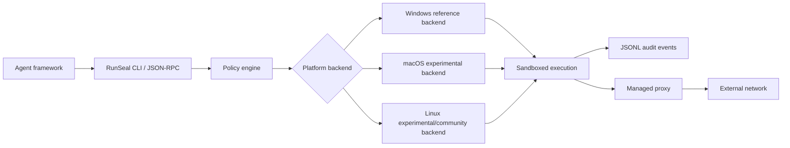

# RunSeal RFCs

[English](README.md) | 简体中文

RunSeal 面向需要执行真实本地工具，同时不能把端点完全交给 Agent 控制的 Agent 应用。

它不是 VM，也不是 Docker 替代品。它让 Agent 继续受益于 host OS 上已有的工具链、企业配置、本地应用和工作区文件，同时把每次本地命令执行收进可配置、可审计、可失败关闭的安全边界里，包含文件系统限制、仅代理出网、合成 home/profile 根目录、执行后清理和结构化审计事件。

Windows reference backend 是企业端 MVP 基线。

> **端侧 AI Agent 的可嵌入安全执行运行时。**

macOS 和 Linux 仍属于同一套跨平台契约，但它们是按单项 capability 实验性升级的开放贡献方向。当前 macOS experimental 覆盖范围限于 `read-only` 搭配 `network.disabled`。当前 Linux experimental 覆盖范围限于 `read-only` 和 `workspace-write` 搭配 `network.disabled`。任何后端能力只有通过共享 conformance suite，并且对未支持请求 fail-closed，才能升级为更强承诺。

RunSeal 不定位为 VM 平台、Docker Desktop 替代品或云端多租户沙箱服务。它的目标是把本地 Agent 执行变成一种受策略约束、可审计、可集成的能力。

## 它解决什么问题

AI Agent 越来越需要执行本地命令：包管理器、测试、lint、代码生成器、数据处理脚本、内部 API 客户端，以及来自社区的工具和技能。只靠“每次命令都询问用户”无法形成稳定的安全边界；运行时需要一个技术边界，让低风险操作可以继续自动执行，同时把敏感操作交给策略和审批流程处理。

RunSeal 关注四类边界：

- **文件系统**：限制读写根目录，保护 workspace 元数据和宿主凭据目录。
- **进程执行**：把一次命令或工具调用建模为可追踪的 `Execution`。
- **网络访问**：支持禁用网络，或只允许通过 managed proxy 出网。
- **审计事件**：记录执行生命周期、策略决策、拒绝原因、代理生命周期和最终结果。
- **保留 host OS 能力**：已安装的工具链、工作区文件、企业配置和本地应用集成在沙箱边界内仍然可用。

## 核心设计

RunSeal 采用 Codex-style 的分层模型：

- **Sandbox**：由 OS 强制执行的文件系统、进程、网络和资源边界。
- **Approval / policy**：治理层，决定哪些操作自动允许、哪些拒绝、哪些需要升级确认。
- **Execution**：沙箱内的一次命令或工具运行，不把它等同于裸进程。
- **Controlled proxy**：企业场景下的统一网络出口，用于路由控制、凭据注入、脱敏和审计。

公开 API 保持平台无关：客户端只需要理解 `read-only`、`workspace-contained`、`workspace-write`、`danger-full-access` 等 sandbox level，以及 `disabled` / `proxy` 网络模式；不需要关心 Windows ACL、macOS Seatbelt profile 或 Linux namespace 的具体实现。


## 架构流程



## MVP 优先级

当前 RFC 将 Windows 作为 MVP reference backend 和企业强安全基线：

- Windows：优先验证受限本地执行身份、文件 ACL、网络阻断和 proxy-only egress，并作为标准的可运行证明。
- macOS：作为 experimental backend 贡献方向，先验证 `/usr/bin/sandbox-exec` / Seatbelt profile 的本地开发可用性，不进入企业强安全基线。
- Linux：按 runtime probe 和 conformance evidence 实验性升级单项能力；当前方向先覆盖 `read-only` + `network.disabled`，其他 sandbox level 仍 fail-closed。

MVP 的重点是跑通：

1. `runseal exec` CLI。
2. policy schema 解析和校验。
3. 平台 backend trait 和能力报告。
4. Windows reference backend。
5. JSON-RPC stdio 协议。
6. JSONL audit 事件。
7. conformance tests，用来推动 macOS / Linux 后端逐步升级。

## 初始 RFC

1. [RFC-0001：Codex-style OS-native sandbox abstraction](rfcs/0001-codex-style-os-native-sandbox-abstraction.md)
2. [RFC-0002：Controlled proxy networking](rfcs/0002-controlled-proxy-networking.md)
3. [RFC-0003：RunSeal policy schema](rfcs/0003-runseal-policy-schema.md)
4. [RFC-0004：Audit event model](rfcs/0004-audit-event-model.md)
5. [RFC-0005：Workspace/user simplification model](rfcs/0005-workspace-user-simplification-model.md)
6. [RFC-0006：Stable execution protocol](rfcs/0006-stable-execution-protocol.md)
7. [RFC-0007：Platform backend threat model and capability matrix](rfcs/0007-platform-backend-threat-model.md)
8. [RFC-0008：MVP implementation plan](rfcs/0008-mvp-implementation-plan.md)
9. [RFC-0009：MVP implementation baseline](rfcs/0009-mvp-implementation-baseline.md)
10. [RFC-0010：RFC/implementation boundary and Windows reference extraction](rfcs/0010-rfc-implementation-boundary-and-windows-reference-extraction.md)
11. [RFC-0011：stdin bytes encoding](rfcs/0011-stdin-bytes-encoding.md)
12. [RFC-0012：Windows single identity and global policy epoch model](rfcs/0012-windows-single-identity-and-global-policy-epoch.md)
13. [RFC-0013：RunSeal service mode](rfcs/0013-service-mode.md)
14. [RFC-0014：Portable backend onboarding for macOS and Linux](rfcs/0014-portable-backend-onboarding.md)
15. [RFC-0015：Escape definition and adversarial conformance model](rfcs/0015-escape-definition-and-adversarial-conformance.md)
16. [RFC-0016：Adversarial conformance harness and case format](rfcs/0016-adversarial-conformance-harness-and-case-format.md)

## CLI 词汇

主 CLI 动词是 `exec`：

```bash
runseal exec --policy workspace-write --network proxy -- pnpm test
runseal exec --policy workspace-contained --network disabled -- python skill.py
```

协议方法名是 `execute`；返回的领域对象是 `Execution`，不是裸 process。

## 不做什么

- 不做云端 VM 沙箱平台。
- 不做 Docker Desktop 替代品。
- MVP 不引入 VM / microVM / container daemon 依赖。
- 不把密钥直接注入沙箱进程。
- 企业默认场景不允许非托管直连网络。
- 不承诺 OS-native sandbox 可以防住所有 kernel-level escape。
- MVP 不实现完整域名 allowlist / denylist 规则引擎。
- 不是一个通用的 sandbox CLI——专为 Agent 应用、IDE、RPA 平台和企业 AI 平台嵌入而设计。

## 参考信号

这些 RFC 基于公开行业信号整理：

- OpenAI Codex：OS-native sandbox、workspace-write 默认语义、网络审批、sandbox 与 approval 分离。
- Linux bubblewrap / Flatpak：基于 namespace 的非特权隔离、默认限制文件系统和网络权限。
- 企业 egress proxy：默认拒绝出网、边界层凭据注入、按请求审计。
- OpenTelemetry / structured observability：沙箱执行和网络出口组件的结构化事件实践。

## 状态

MVP PRD-ready。当前 RFC 集已经给出 Windows-first 的可实现边界；Windows 是 reference backend 和企业安全基线，macOS / Linux 继续复用同一协议抽象，并通过开源贡献和 conformance evidence 逐步补足。
