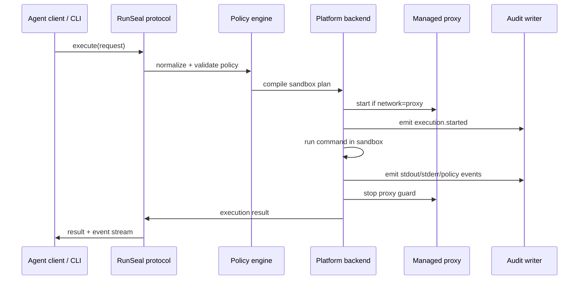

# RFC-0008: MVP implementation plan

## Summary

RunSeal should start with a Windows reference backend MVP that proves a stable agent execution contract: policy parsing, command execution, platform backend selection, structured event streaming, audit logging, and fail-closed sandbox enforcement.

Windows is the reference backend and MVP security baseline. macOS remains a first-class planned backend but is not an equal launch blocker. Linux remains future/community.

The MVP should not try to finish enterprise proxy governance, domain rules, macOS enterprise-grade enforcement, Linux isolation, cloud execution, or UI approval flows. Those remain future layers on top of the same policy and protocol model. macOS and Linux should be easy to contribute behind the same backend trait and conformance suite, but they are not technical-preview gates.

## Goals

1. Build a working `runseal` CLI and local protocol server skeleton.
2. Implement the Windows sandbox backend first as the reference backend and enterprise security baseline.
3. Keep macOS and Linux as compile-time/backend abstraction placeholders that can be completed through open-source contributions.
4. Support the four filesystem sandbox levels and two network modes at the product-contract level.
5. Ensure all user-submitted command execution paths use the same policy injection path.
6. Produce structured audit events suitable for later enterprise integration.
7. Provide conformance tests that let external agent frameworks and backend contributors validate behavior.

## Non-goals

- No hosted sandbox service.
- No VM/microVM/container daemon dependency.
- No full enterprise network rule engine.
- No complete domain allowlist/denylist UI or policy authoring surface.
- No broad automatic toolchain discovery beyond the initial safe defaults and explicit allowlists.
- No cross-platform GUI approval prompt.
- No source references to private products, private issue trackers, internal repository names, or internal codenames.
- No claim that macOS or Linux provide the same enterprise security baseline as the Windows reference backend during the MVP.
- No requirement that macOS reach enterprise-baseline parity before the Windows MVP technical preview ships.

## Public API posture

RunSeal public APIs should use stable, platform-neutral names:

- `SandboxLevel`: `read-only`, `workspace-contained`, `workspace-write`, `danger-full-access`
- `NetworkPolicy.mode`: `disabled`, `proxy`
- `ExecutionRequest`
- `Execution`
- `ExecutionResult`
- `PolicyRef`
- `AuditEvent`

Do not expose backend-private controls such as Windows profile names, macOS Seatbelt profile fragments, SIDs, ACL details, WFP rule names, sandbox-exec flags, or app-specific setting names in the public model.


## Execution flow



## MVP scope

### Phase 0: Repository and crate structure

Create a Rust workspace with these initial modules or crates:

- `runseal-cli`: CLI entrypoint.
- `runseal-core`: protocol objects, policy model, execution state machine.
- `runseal-policy`: policy parsing, normalization, and validation.
- `runseal-backend`: platform backend trait and compiled plan model.
- `runseal-backend-windows`: Windows reference backend implementation.
- `runseal-audit`: JSONL audit event writer and redaction helpers.
- `runseal-protocol`: JSON-RPC request/response and event schema.

Initial CLI:

```bash
runseal exec --policy workspace-write --network proxy -- <program> [args...]
runseal exec --policy workspace-contained --network disabled --cwd <path> -- <program> [args...]
runseal capabilities
runseal explain-policy --policy workspace-write --network proxy
```

### Phase 1: Shared policy and execution model

Implement:

- `SandboxLevel`
- `NetworkPolicy`
- `FilesystemPolicy`
- `EnvironmentPolicy`
- `RuntimeRoots`
- `ToolchainReadRoots`
- `ProtectedSubpaths`
- `ExecutionRequest`
- `ExecutionResult`
- `ExecutionEvent`
- structured errors

Validation rules:

- Unknown mandatory fields fail.
- `danger-full-access` is allowed only when explicitly requested.
- `proxy` mode requires a managed proxy plan.
- Unsupported backend/policy combinations fail closed.
- Environment inheritance defaults to minimal/safe values instead of full host inheritance.

### Phase 2: Backend trait and platform selection

Define a backend trait similar to:

```rust
trait SandboxBackend {
    fn platform(&self) -> Platform;
    fn capabilities(&self) -> BackendCapabilities;
    fn supports(&self, policy: &SandboxPolicy) -> SupportResult;
    fn compile(&self, request: &ExecutionRequest, policy: &SandboxPolicy) -> Result<PlatformSandboxPlan>;
    fn execute(&self, plan: PlatformSandboxPlan) -> ExecutionStream;
    fn cancel(&self, execution_id: ExecutionId) -> Result<()>;
}
```

Backend selection:

- Windows: use the Windows sandbox backend for all non-`danger-full-access` executions.
- macOS: return unsupported for sandboxed execution unless an experimental backend is explicitly built and reports support for the requested capability.
- Linux: return unsupported for sandboxed execution in MVP; local execution only for explicit `danger-full-access`.

### Phase 3: Windows reference backend

Implement enough Windows backend behavior to prove the policy contract:

- Create or locate the sandbox identity/group required for low-privilege execution.
- Create a runtime root with synthetic HOME/AppData/LocalAppData/Temp/Tmp.
- Compile filesystem allow/deny roots for each sandbox level.
- Protect workspace metadata directories by default.
- Use OS-level network restrictions for `disabled`.
- For `proxy`, only allow access to the managed proxy endpoint and block direct outbound egress.
- Return structured setup/repair errors rather than falling back to unrestricted local execution.

Windows acceptance tests should cover:

- workspace write succeeds in `workspace-write`.
- workspace-external write fails in `workspace-write`.
- any write fails in `read-only`.
- host profile read fails in `workspace-contained` for common credential/profile paths.
- `.git`, `.agents`, `.codex` writes fail by default.
- direct network fails in `disabled`.
- proxy mode cannot reach the network without the managed proxy path.

### Phase 4: macOS experimental backend contribution track

Prepare a macOS backend skeleton and promotion criteria, without making macOS a technical-preview gate. A contributed macOS backend should prove each supported capability through the conformance suite before it is documented as supported.

- Use `/usr/bin/sandbox-exec` by absolute path.
- Generate Seatbelt profiles from the normalized policy.
- Pass dynamic roots through safe `-D` parameters or equivalent escaping-safe substitutions.
- Build path plans with canonical/raw path variants for temp and `/private/var` style roots.
- Support `read-only`, `workspace-contained`, and `workspace-write` semantics.
- Protect workspace metadata directories by default.
- For `network.disabled`, omit network permissions.
- For `network.proxy`, start a managed local HTTP proxy, inject proxy environment variables, and only allow the loopback proxy endpoint.
- Stop proxy listeners and forwarding tasks when the command exits or is cancelled.
- Report unsupported or degraded capabilities fail-closed instead of silently falling back to local execution.

macOS promotion tests should cover:

- workspace write succeeds in `workspace-write`.
- workspace-external write fails in `workspace-write`.
- workspace write fails in `read-only`.
- `workspace-contained` cannot read broad host home paths unless explicitly allowed.
- `.git`, `.agents`, `.codex` writes fail by default.
- network fails in `disabled`.
- proxy guard shuts down after command completion/cancellation.
- `danger-full-access` bypasses `sandbox-exec` explicitly.

### Phase 5: JSON-RPC protocol and event streaming

Implement JSON-RPC 2.0 over stdio first. Unix socket/named pipe can follow without changing method semantics.

Required methods:

- `getVersion`
- `getCapabilities`
- `explainPolicy`
- `execute`
- `cancelExecution`
- `getExecution`
- `subscribeEvents`
- `disposeSession`

Required event families:

- execution lifecycle
- stdout/stderr chunk
- policy decision
- sandbox backend setup
- network proxy lifecycle
- final result
- structured error/denial

### Phase 6: Audit JSONL

Write one JSONL audit stream per execution or per session. Include:

- execution id
- policy digest
- backend platform
- sandbox level
- network mode
- command summary
- policy decisions
- denial events
- proxy lifecycle events
- exit code/result
- timing/resource summary where available

Redaction rules:

- Do not log full environment by default.
- Redact tokens, secrets, Authorization headers, cookies, and known credential variable names.
- Log normalized path classifications where possible instead of leaking full sensitive paths.

## Default policy profiles

MVP should include named built-in profiles:

- `read-only`: broad safe read where platform allows, no writes, network disabled by default.
- `workspace-contained`: workspace/runtime/toolchain/platform roots only, workspace/runtime writable, network disabled by default unless explicitly set to proxy.
- `workspace-write`: default readable surface, workspace/runtime writable, network proxy by default.
- `danger-full-access`: local execution, explicit high-risk mode.

Suggested product defaults:

- Developer default: `workspace-write + proxy`.
- Untrusted workspace: `workspace-contained + disabled`.
- Enterprise/unattended default: `workspace-contained + proxy`.
- Diagnostics: `danger-full-access`, explicit only.

## Conformance test matrix

The repository should include a conformance test harness that can run on each supported platform.

Minimum test categories:

1. Policy parsing and normalization.
2. Backend capability reporting.
3. Filesystem allow/deny behavior.
4. Protected workspace metadata behavior.
5. Environment inheritance and denylist behavior.
6. Network disabled behavior.
7. Proxy-only egress behavior.
8. Cancellation behavior.
9. Structured audit event shape.
10. JSON-RPC compatibility snapshots.

Tests that cannot run on the current host should skip with a structured reason, not pass silently.

## Implementation order

Recommended order for agent implementation:

1. Build data models, CLI skeleton, and tests for parsing/validation.
2. Implement local `danger-full-access` execution explicitly as the non-sandbox baseline.
3. Add backend trait and capability reporting.
4. Implement Windows backend enough for CI/manual verification on Windows.
5. Add macOS and Linux backend skeletons that report unsupported capabilities fail-closed.
6. Add JSONL audit events for all execution paths.
7. Add JSON-RPC stdio protocol and event subscription.
8. Add managed proxy guard abstraction and proxy-only tests.
9. Harden conformance tests and public docs so future macOS/Linux backends can be promoted without changing the public protocol.

## Handoff expectations for coding agents

Coding agents should work against public RunSeal terminology only. They must not mention private product names, private issue IDs, or internal repository names in code, commits, README, RFCs, or public issues.

Each implementation task should report:

- files changed
- policy behavior implemented
- tests added
- commands run
- platform used
- unsupported platform skips
- remaining fail-closed gaps

## Acceptance criteria

The MVP is ready for public technical preview when:

1. `runseal exec` can execute commands on Windows under at least `read-only`, `workspace-write`, and `danger-full-access`.
2. `workspace-contained` exists in the policy model and has working first-pass enforcement on Windows.
3. `network.disabled` is enforced on Windows.
4. `network.proxy` has a managed proxy-only path or returns a fail-closed unsupported result.
5. JSONL audit events are emitted for successful executions, denials, cancellations, and backend setup failures.
6. JSON-RPC stdio supports execution lifecycle and event subscription.
7. Conformance tests can distinguish supported, unsupported, experimental, denied, and failed states.
8. Public documentation contains no private/internal product references.
